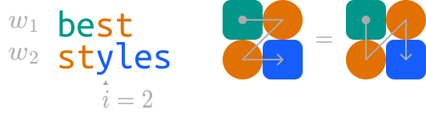

# Square Words

Let $w_1$ and $w_2$ be two words, both of length >= 4.

Let $L = \min(\text{len}(w_1), \text{len}(w_2))$.

Then, we say $w_1$ and $w_2$ are _square words_ if there exists an integer $i$ where $2 \leq i \lt L-1$ and $w_1[:i] + w_2[:i] = w_1$ and $w_1[i:] + w_2[i:] = w_2$.

To denote _square words_, we'll use the tuple $(w_1, w_2, i)$.

For example, ("best", "styles", 2):



This quick project was inspired by a recent trip to Amsterdam where I stumbled upon this storefront.

[

📍 Best Styles Zaandam, Netherlands
](https://maps.app.goo.gl/M9aW4FrkTYkj9KKq9)

I'm not sure if there's a proper name for this word pattern so I've coined the term _square words_. If you've seen this somewhere else, please let me know!

---

First, I grabbed words and their frequencies from [Google Books Ngram Viewer](https://books.google.com/ngrams).

```bash
python proc.py
```

Then, I found all _square words_ using

```bash
python square_words.py
```

The top 1000 _square words_ by relevance are in `square_words.json`, which looks like

```
[
  ["best", "styles", 2],
  ["mike", "kebab", 2],
  ["atomic", "michael", 3],
  ...
]
```

The full list of _square words_ is in `square_words.json.gz`.
